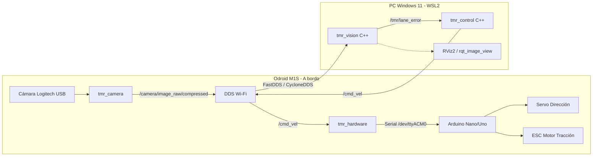

# Vehículo Autónomo TMR (ROS 2 Foxy + OpenCV C++ + Odroid M1S + WSL2)

Sistema de navegación y control autónomo para vehículo a escala (Ackermann) diseñado para seguir carriles en la pista oficial del **Torneo Mexicano de Robótica (TMR)**.

Permite desarrollar y depurar en **Windows 11 (WSL2)** con procesamiento remoto vía Wi-Fi, y sincronizar mediante **GitHub** con la **Odroid M1S** para la ejecución a bordo.

---

## 🏎️ Arquitectura General



---

## 📁 Estructura del Repositorio

```text
VehiculoTMR/
├── config/
│   └── wslconfig_example.ini        # Configuración de red en espejo para Win11
├── scripts/
│   └── setup_ros_network.sh         # Script para fijar ROS_DOMAIN_ID y entorno
├── firmware/
│   └── arduino_controller/
│       └── arduino_controller.ino   # Firmware Arduino para Servo + ESC (con Watchdog)
├── tmr_ws/
│   └── src/
│       ├── tmr_bringup/             # Launch files y vehicle_params.yaml
│       ├── tmr_camera/              # Nodo C++ captura V4L2 y compresión JPEG
│       ├── tmr_vision/              # Detección OpenCV C++ (IPM, carril TMR)
│       ├── tmr_control/             # Control lateral (Stanley/PID) y longitudinal
│       └── tmr_hardware/            # Puente Serie ROS 2 <-> Arduino
└── README.md
```

---

## 🚀 Guía de Puesta en Marcha Paso a Paso

### 1. Configurar Red entre Win 11 (WSL2) y Odroid M1S
Para que ROS 2 descubra nodos a través de Wi-Fi entre WSL2 y la Odroid, WSL2 debe compartir la tarjeta de red de Windows:

1. En Windows, abre o crea el archivo: `C:\Users\<Tu_Usuario>\.wslconfig` y copia lo siguiente (ver [wslconfig_example.ini](config/wslconfig_example.ini)):
   ```ini
   [wsl2]
   networkingMode=mirrored
   firewall=false
   autoProxy=true
   ```
2. Abre PowerShell como Administrador y reinicia WSL:
   ```powershell
   wsl --shutdown
   ```
3. En cada terminal que uses (tanto en WSL2 como en Odroid), activa el entorno con:
   ```bash
   source scripts/setup_ros_network.sh
   ```
   *(Asegura que ambos tengan `ROS_DOMAIN_ID=42` y `ROS_LOCALHOST_ONLY=0`)*.

---

### 2. Cargar Firmware en el Arduino
1. Conecta el Arduino a tu PC o Odroid.
2. Abre [arduino_controller.ino](firmware/arduino_controller/arduino_controller.ino) en Arduino IDE.
3. Conexiones físicas:
   - **Pin 9:** Señal del Servo de Dirección.
   - **Pin 10:** Señal del ESC del motor.
   - **GND:** Masa común entre Arduino, Servo, ESC y Odroid.
4. Carga el sketch a 115200 baudios.

---

### 3. Compilación del Workspace (`tmr_ws`)
Ejecuta esto tanto en **WSL2** como en la **Odroid M1S**:

```bash
cd tmr_ws
source /opt/ros/foxy/setup.bash
colcon build --symlink-install
source install/setup.bash
```

---

### 4. Flujo de Trabajo con GitHub

#### Desde tu PC (WSL2 o Windows):
```bash
git init
git add .
git commit -m "Arquitectura inicial vehículo autónomo TMR"
git branch -M main
git remote add origin <URL_DE_TU_REPOSITORIO_GITHUB>
git push -u origin main
```

#### En la Odroid M1S:
```bash
git clone <URL_DE_TU_REPOSITORIO_GITHUB> ~/VehiculoTMR
cd ~/VehiculoTMR/tmr_ws
source /opt/ros/foxy/setup.bash
colcon build --symlink-install
```

---

### 5. Modo de Operación 1: Procesamiento Remoto (Desarrollo y Ajuste)

#### Paso A: En la Odroid M1S (A bordo del auto)
Lanza la cámara y el puente serie con el Arduino:
```bash
source ~/VehiculoTMR/scripts/setup_ros_network.sh
ros2 launch tmr_bringup odroid_vehicle.launch.py
```

#### Paso B: En tu PC (WSL2)
Lanza el procesamiento de visión y el controlador:
```bash
source scripts/setup_ros_network.sh
ros2 launch tmr_bringup pc_remote_processing.launch.py
```

#### Paso C: Monitorear Visión en Tiempo Real (En PC)
Para ver la detección de carril en tiempo real:
```bash
ros2 run rqt_image_view rqt_image_view /tmr/vision_debug
```

---

### 6. Modo de Operación 2: Ejecución 100% a Bordo (Competición)
Una vez afinados los parámetros, puedes ejecutar todo el sistema de forma independiente en la Odroid M1S sin depender de la señal Wi-Fi:

```bash
source ~/VehiculoTMR/scripts/setup_ros_network.sh
ros2 launch tmr_bringup all_on_board.launch.py
```

---

### 7. Parámetros de Calibración
Todos los ajustes del vehículo se encuentran centralizados en [vehicle_params.yaml](tmr_ws/src/tmr_bringup/config/vehicle_params.yaml):
- **`binary_threshold`**: Umbral para detectar las líneas blancas sobre el piso negro (por defecto 200).
- **`lane_width_m`**: Ancho del carril oficial (0.40 m).
- **`k_stanley`**: Ganancia de recuperación del controlador Stanley.
- **`v_max` y `v_min`**: Límites de velocidad en rectas y curvas cerradas.
- **`port`**: Puerto serie del Arduino (`/dev/ttyACM0` o `/dev/ttyUSB0`).
